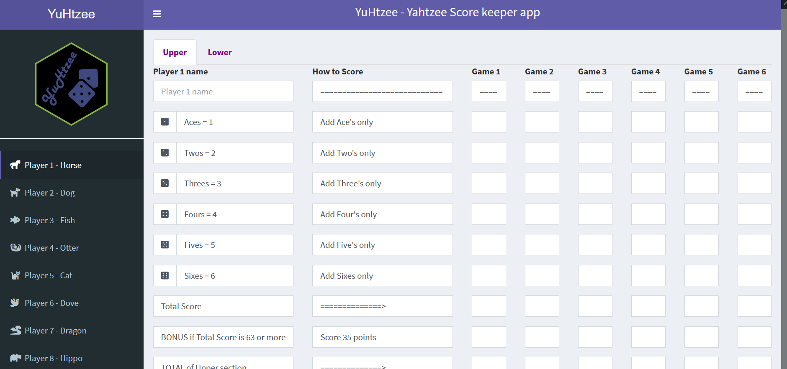
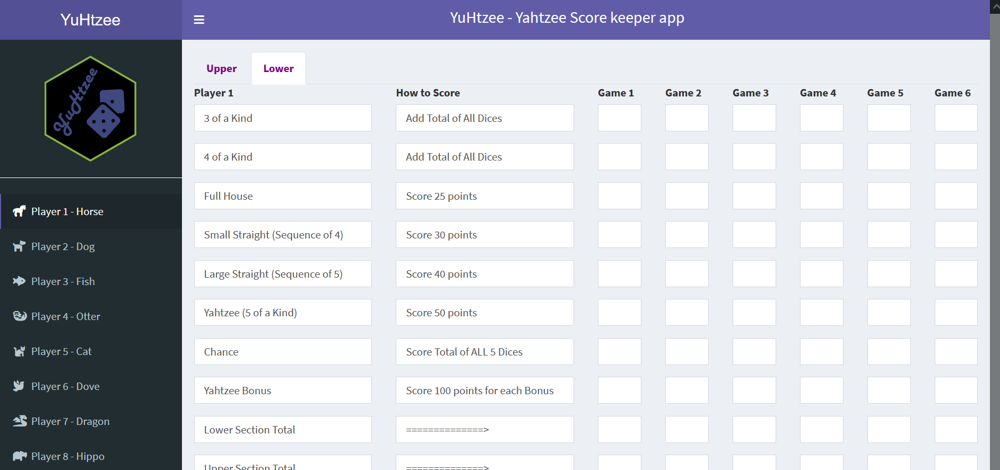

# YuHtzee - Yahtzee Score Keeper app
If you suddenly had an immense urge to play Yahtzee, but you realized you do not have scoring cards anymore, then YuHtzee is just the app for you.\
YuHtzee replaces all the pens and paper score cards with an easy-to-use Scoring dashboard.\
YuHtzee can replace paper scoring cards for 1-10 people.\
YuHtzee does not perform any calculations by itself, rather it helps you to organize the Yahtzee scores after each game.\
For easy of use, each player has their own tab, with an animal nickname and number.\
The player's name can also be provided in the corresponding field.\
To help you out more, Upper and Lower sections of a classical Yahtzee scoring card have been seperated into two windows.

# Setup
Option 1: Hosted locally 
1. Download all provided files.
2. Download and install the [shinyShortcut](https://cran.r-project.org/web/packages/shinyShortcut/README.html) package and follow the instructions. 
3. Run the _shinyShortcut_ command. You will get a standalone .VBS executable file which can be executed without R or RStudio being open.

Option 2: Hosted online, e.g. shinyapps.io (Recommended)
1. Download all files and create an account in shinyapps.io and follow their instructions furter.
2. YuHtzee is great to be hosted online, as it has integrated persistent data storage solution for you to note down results. Also, due to the relatively large number of UI elements, hosting on a server should decrease the chance of crashes due to limited computational resources.
3. We are emplyong a special persistent data storage solution inside Shiny, so even if your app closes itself, upon re-loading your score results will not be lost.

Before you do the setup yourself, you can have a look at the full YuHtzee app here: https://altayyuzeir.shinyapps.io/yuhtzee/

# Acknowledgements and my thanks
To Dr. Obianom, the creator of [shinyStorePlus](https://github.com/oobianom/shinyStorePlus) for the incredibly useful tool for persistent data storage inside Shiny.
